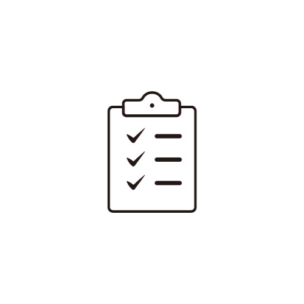

# My Todo

Todo app that helps us to manage day to day tasks and accomplish them quickly.

## User 

 1.Login and signup.                 
 2.Add task.         
 3.Find task by id.  
 4.Sort task based on priority and task id.  
 5.Mark task as important,completed and also deleted.  
 6.Choose you favorite task color and much more.

 ## Tech Stack

 Java | Hibernate | Spring Boot | Spring Framework | Spring Data JPA | Spring Boot Validation | Spring Boot Web | Spring Boot DevTools| Postman | MySQL Database | Maven | HTML | CSS | JavaScript | HTML | CSS | JavaScript | React

 ## Components

 - Login
 - signup
 - Add task
 - Render task
 - Loader
             
## Prerequisites

- Java 8 or higher
- Maven
- MySQL Server
- React
 

